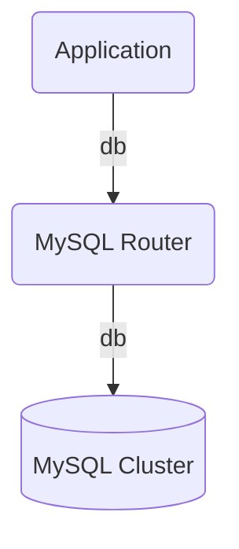

# mysql-router-operator

## Description

The Charmed MySQL Router Operator is a database proxy for Group Replicated MySQL clusters.

The proxy sits between the MySQL cluster and a client application, e.g.:



## Usage

This charm must be used coupled with mysql-operator charm, through a relation, e.g.:

```bash
juju deploy mysql-operator
juju deploy mysql-router-operator
juju add-relation mysql-operator mysql-router-operator
```

## Relations

Relations are defined in `metadata.yaml` are:

* Requires: db
* Provides: db

## Contributing

Please see the [Juju SDK docs](https://juju.is/docs/sdk) for guidelines on
enhancements to this charm following best practice guidelines, and
[CONTRIBUTING.md](https://github.com/canonical/mysql-router-operator/blob/main/CONTRIBUTING.md)
for developer guidance.
