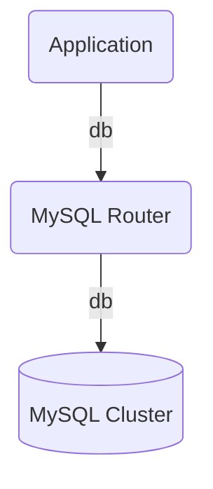

# mysql-router-operator

## Description

The Charmed MySQL Router Operator is a database proxy for [Group Replicated
MySQL](https://dev.mysql.com/doc/refman/8.0/en/mysql-innodb-cluster-introduction.html)
clusters.

MySQL Router is a middleware that provides transparent routing of MySQL servers
and client applications. More info at [MySQL
Router](https://dev.mysql.com/doc/mysql-router/8.0/en/).

The proxy sits between the MySQL cluster and a client application, e.g.:



## Usage

Until the MySQL Router Machine Charm is published, you need to follow the build
& deploy instructions from [CONTRIBUTING.md](link) to deploy the charm. After
building and deploying the charm, it must be couple with the [mysql-operator
charm](link), through a relation, e.g.: 

```bash
juju deploy mysql-operator
juju deploy ./mysqlrouter_ubuntu-20.04-amd64.charm
juju add-relation mysql-operator mysql-router-operator
```

To more details on how to build and deploy, check
[CONTRIBUTING.md](https://github.com/canonical/mysql-router-operator/blob/main/CONTRIBUTING.md).

## Relations

[Relations](https://juju.is/docs/sdk/relations) are defined in `metadata.yaml` as:

* Requires: db
* Provides: db

## License
The MySQL Router Operator is free software, distributed under the Apache
Software License, version 2.0. See
[LICENSE](https://github.com/canonical/mysql-router-operator/blob/main/LICENSE)
for more information.


## Security
Security issues in the MySQL Router Operator can be reported through
[LaunchPad](https://wiki.ubuntu.com/DebuggingSecurity#How%20to%20File). Please
do not file GitHub issues about security issues.


## Contributing

Please see the [Juju SDK docs](https://juju.is/docs/sdk) for guidelines on
enhancements to this charm following best practice guidelines, and
[CONTRIBUTING.md](https://github.com/canonical/mysql-router-operator/blob/main/CONTRIBUTING.md)
for developer guidance.
